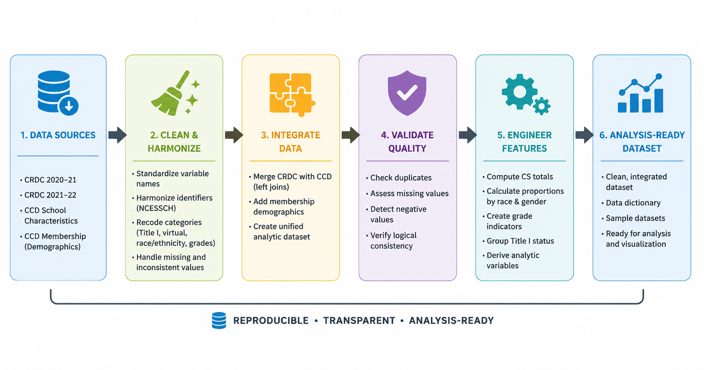

# k12-cs-course-data-pipeline
A reproducible R-based pipeline that cleans, harmonizes, and integrates CRDC and CCD data to support analysis of K–12 computer science course access and enrollment in U.S. schools (2020–2022). 

**Author:** Omodolapo Ojo, PhD  

---

## Project Overview

This project analyzes the availability and enrollment patterns of K–12 Computer Science (CS) courses across U.S. public schools using the Civil Rights Data Collection (CRDC) and the Common Core of Data (CCD) for the 2020–21 and 2021–22 school years.

**This repository demonstrates a full data engineering pipeline**, including:

- Data ingestion from multiple raw sources  
- Cleaning and harmonization of inconsistent variables  
- Standardization of unique school identifiers (`NCESSCH` / `Combined_Key`)  
- Merging multi-year datasets  
- Validation of logical consistency and negative values  
- Derivation of aggregated and proportional variables  
- Production of analysis-ready datasets 

This is a **reproducible, multi-step data engineering workflow** that transforms messy administrative datasets into a clean, integrated resource ready for policy research.

---

## Data Sources

### Civil Rights Data Collection (CRDC)  
- Contains school-level enrollment, course offerings, and student demographic data  
- Publicly available: [CRDC Data Portal](https://ocrdata.ed.gov/)  
- Datasets used: 2020–21 and 2021–22 K–12 CS enrollment tables  

### Common Core of Data (CCD)  
- Contains school characteristics, enrollment counts by grade, and Title I status  
- Publicly available: [CCD Data Files](https://nces.ed.gov/ccd/)  
- Datasets used: School characteristics and membership files for 2020–21 and 2021–22  

**Note:** Raw datasets are not hosted here due to size. Users must download them separately and place them in the `data/` folder before running the analysis.

---

## Method/Data Engineering Pipeline

1. **Data Ingestion**
   - Read multiple CSV files from CRDC and CCD for 2020–21 and 2021–22  
   - Separate files for enrollment, school characteristics, and membership

2. **Variable Selection & Harmonization**
   - Selected only necessary columns  
   - Renamed all variables to **human-readable, consistent names**  
   - Standardized categorical variables (e.g., LEP → EL)

3. **Identifier Standardization**
   - Converted `Combined_Key` and `NCESSCH` to 12-character strings  
   - Ensured uniqueness of identifiers for safe joins

4. **Dataset Merging**
   - Left-joined CRDC and CCD datasets with membership files  
   - Collapsed multi-grade membership data into school-level totals  
   - Produced one long-format multi-year dataset

5. **Data Validation & Cleaning**
   - Replaced negative values with `NA`  
   - Flagged inconsistencies (e.g., race totals exceeding total enrollment)  
   - Removed logically inconsistent rows  

6. **Derived Variables**
   - Aggregated race and gender totals  
   - Calculated proportional participation by race and gender  
   - Derived school-level indicators for Title I and grade levels

7. **Output Generation**
   - Sample of the final dataset (CCD matched) ([`combined_data_sample_150_ccd.csv`](combined_data_sample_150_ccd.csv))
   - Sample of the final dataset (full version) ([`combined_data_sample_150_full.csv`](combined_data_sample_150_full.csv))
   - Basic data dictionary ([`data_dictionary.csv`](data_dictionary.csv))
 
> **Note:** Every step is reproducible via `K12_CS_Analysis.Rmd`. This is a full **data engineering → analysis → visualization pipeline**.

---

## Outputs

### 1. Cleaned Analytical Dataset
Listed under item #7 of the methods / data engineering pipeline 

---

### 2. Reproducible Report
- [`K12_CS_Analysis_Data_Pipeline.Rmd`](K12_CS_Analysis_Data_Pipeline.Rmd) — Complete reproducible R Markdown workflow documenting data preparation, analysis procedures, and output data and tables

---

### 3. Data Dictionary (Snopsis)
Get full access following relevant link under item #7 of the methods / data engineering pipeline 

Some key variables in the final dataset:

| Variable | Description |
|----------|-------------|
| `Combined_Key` | Unique 12-digit school identifier |
| `SCHOOL_YEAR` | School year of data (2020–21 or 2021–22) |
| `CS_Classes_Offered` | Number of CS courses offered at the school |
| `Total_CS_Enrolment` | Total students enrolled in CS courses |
| `Prop_Male_CS` | Proportion of male students in CS courses |
| `Prop_White_CS`, `Prop_Black_CS`, etc. | Proportion of students in CS by race |
| `TITLEI_STATUS_TEXT` | Title I status of the school |
| `Elementary`, `Middle`, `High` | School grade-level indicators |
| Additional columns | Derived enrollment totals, and proportional measures |

---

## Reproducibility

To reproduce the analysis:

1. Download the CRDC and CCD datasets from the sources provided above.
2. Save the datasets on your local machine.
3. Open [`K12_CS_Analysis_Data_Pipeline.Rmd`](K12_CS_Analysis_Data_Pipeline.Rmd) in RStudio.
4. Update the file paths in the R Markdown file to match the locations of the datasets on your computer.
5. Knit the R Markdown file to generate the analysis outputs.

**Important note:** The current R Markdown workflow contains absolute file paths from the original development environment. Before running the analysis, users must update these paths to point to the appropriate locations on their own local machine. The repository does not include the full CRDC and CCD datasets due to their large file sizes.

**Alternative execution option:** Because the analysis workflow is extensive, knitting the full R Markdown file may occasionally fail depending on local system resources or RStudio settings. If this occurs, users can copy and paste the R code chunks directly into an R script or R console and run the analysis sequentially.

---

## Contribution

This repository demonstrates:

- Large-scale administrative data integration  
- End-to-end reproducible data engineering workflows  
- Structured validation and transformation pipelines
- Comprehensive datasets for educational policy research

---

